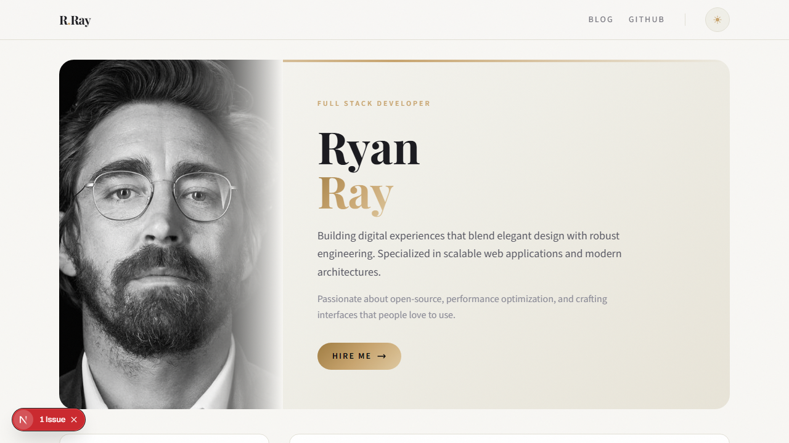

# Next Simple Portfolio

A modern developer portfolio built with Next.js 16 (App Router), React 19, Tailwind CSS and MDX.



### Tech Stack

- **Next.js 16** - App Router with static rendering (SSG)
- **React 19** - Server & Client Components
- **Tailwind CSS 3** - Utility-first styling with dark mode
- **MDX** - Blog posts with Markdown + JSX

### Features

- Static site generation (SSG) for all pages
- Dark/Light mode with localStorage persistence
- MDX blog with frontmatter support
- GitHub API integration
- Editorial design with Playfair Display + Source Sans 3 typography
- Animated skill bars, timeline experience, portfolio grid
- Glassmorphism navbar with backdrop blur
- Noise texture overlay and custom scrollbar
- Responsive layout (mobile, tablet, desktop)
- Progress bar on route navigation

### Getting Started

```bash
npm install
npm run dev
```

Open [http://localhost:3000](http://localhost:3000)

### Build

```bash
npm run build
npm start
```

### Project Structure

```
src/
├── app/           # Pages (layout, home, blog, github)
├── components/    # UI components (Header, Skills, Portfolio, etc.)
├── context/       # Global providers
├── data/          # Projects and skills data
├── libs/          # MDX utilities
└── posts/         # MDX blog posts
```
